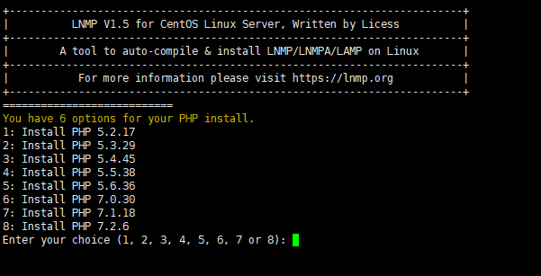
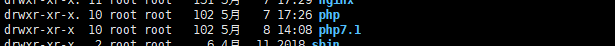
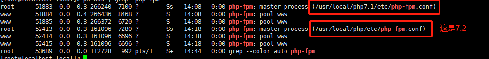
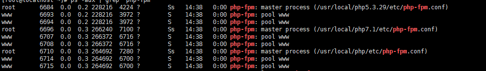

# 题记

对于一个项目来说，多版本的情况可能性很小，但对于开发者来说，不同的项目对应不同的版本，十分常见，机子资源有限，那么就只能
多版本来运行了。

# 基于LNMP来安装

之前的PHP 7.2 就是用这个全家桶来搞的，目前的手头上的项目需要7.1.18和5.3.29这两个版本，先用这个全家桶来安装一下7.1.18看看。

**进入 lnmp 目录执行**

```php
./install.sh mphp
```


选择想要的版本，Enter,喝杯咖啡，等待结果就行

弹指一挥间，自动安装完成

在 /usr/local 目录下，你会发现多了个 php7.1



检查一下是否已经启动

```php
ps aux | grep 'php-fpm'
```



看来自动启动好了

之后在nginx中的 fastcgi_pass 改成对应的 sock链接就行

查看这个可以在对应的 php-fpm.conf 中查看，如果是lnmp的话，不出意外是在tmp下的。

```php
location ~ \.php$ {
             fastcgi_pass   unix:/tmp/php-cgi7.1.sock;
             # fastcgi_pass   unix:/tmp/php-cgi.sock;
             fastcgi_split_path_info ^(.+\.php)(.*)$;
             fastcgi_param PATH_INFO $fastcgi_path_info;
             fastcgi_index  index.php;
             fastcgi_param  SCRIPT_FILENAME  $document_root$fastcgi_script_name;
             include        fastcgi_params;
        }
```

这样不同的项目就能依据自己的需要去配置版本了。

# 自行编译安装任意版本

其实lnmp提供的都是稳定版本的，基本上够用了，1.5直接从5.3.29-7.2.6，跨幅还是可以的，基本上够用。不过为了了解一下编译安装，
并整合到里面，5.3.29的版本，我选择用 **从官网下载，编译安装一下**。

实现的结果要同 7.1.18，**开机自启，加入服务**。

此类教程网上更加详尽的有很多，但 **纸上得来终觉浅,绝知此事要躬行**

参看文章：
[Linux上编译安装PHP](http://www.php.cn/php-weizijiaocheng-400110.html)

**下载对应的php版本**

这里选择在线下载

```php
wget https://www.php.net/distributions/php-5.3.29.tar.gz
```

（有点慢，建议换资源，不过暂时没找到，先忙点别的事情去了）

好吧，膝关节给跪了，3次节点错误，下到一半就挂了，果断换资源了。

```php
wget http://cn2.php.net/get/php-5.3.29.tar.gz/from/this/mirror
```
这样子下载下来的名字是mirror的

```php
wget -O php-5.3.29.tar.gz http://cn2.php.net/get/php-5.3.29.tar.gz/from/this/mirror
```

上述命令为重命名下载，wget更多的用法，可以自行搜索

```php
tar -zxf php-5.3.29.tar.gz
```

解压后进入安装目录，开始三部曲 

1. configure 

2. make 

3. make install

```php
./configure \
--prefix=/usr/local/php5.3.29 \
--with-config-file-path=/usr/local/php5.3.29/etc \
--disable-fileinfo \
--with-pdo-mysql=/usr/local/mysql \
--with-iconv=/usr/local/lib/libiconv \
--with-mcrypt \
--with-bz2 \
--with-gd \
--with-freetype-dir \
--with-jpeg-dir \
--with-png-dir \
--with-zlib-dir \
--with-libxml-dir \
--with-curl \
--with-pear \
--with-openssl \
--with-fpm-group=www \
--with-fpm-user=www \
--enable-fpm \
--enable-xml \
--enable-bcmath \
--enable-shmop \
--enable-sysvsem \
--enable-inline-optimization \
--enable-mbregex \
--enable-mbstring \
--enable-gd-native-ttf \
--enable-pcntl \
--enable-sockets \
--enable-soap \
--enable-session \
--enable-zip
```
上面的配置

```php
--with-iconv=/usr/local/lib/libiconv
```

这是我后加的，系统中之前已经安装过，所以直接引进来。之前没有的话，configure 过程中会报错，不过也可以选择不安装这个扩展。
iconv这个扩展可以不用的。

（[更多处理方案](https://www.cnblogs.com/rwxwsblog/p/5451467.html)）

原则上一般这个过程报错，**解决方案就是安装这些依赖**

之后 make && make install  ,一气呵成。

HP安装完成，进行配置，进入/usr/local/php5.3.29/etc 中，发现没有php.ini文件，
这时应该将安装包目录 /tmp/php-5.3.29 下的php.ini-production 复制到 /usr/local/php5.3.29/etc 下

```php
cp /tmp/php-5.3.29/php.ini-production php.ini
```

php-fpm的配置文件不存在，这边参考 lnmp里面的配置

```php
cp /usr/local/php/etc/php-fpm.conf php-fpm.conf
```

然后修改对应的启动参数

这样子 启动的 php-fpm 的配置就和之前的一致了

**加入服务自启**

在 /etc/init.d 里面增加 php-fpm5.3.29

参考 lnmp 里面的

```php
cd /etc/init.d
cp php-fpm php-fpm5.3.29
vi php-fpm5.3.29
# 修改下面的内容
# prefix=/usr/local/php ==> prefix=/usr/local/php5.3.29

# 加入到自启服务
chkconfig --add php-fpm5.3.29
```

接下来 reboot 



上图可看到，三种php-fpm已经启动

接下来就是nginx 里面fastcgi 自行选择了


**参考文章**
[Linux上编译安装PHP](http://www.php.cn/php-weizijiaocheng-400110.html)
[php编译安装configure 一些参数详解](https://blog.csdn.net/niluchen/article/details/41513217)
[编译php ./configure命令enable和with有什么区别](https://segmentfault.com/q/1010000009174725/a-1020000009175172)
[核心配置选项列表 ](https://www.php.net/manual/zh/configure.about.php)
[Linux(CentOS)下设置php-fpm开机自动启动](https://www.cnblogs.com/tongl/p/7217283.html)

在编译安装的过程中，查看这些文献，算是稍微了解了一下php编译安装,之前都是用集成工具（公司里面运维处理了）。
安装后，对于Linux的服务自启也优老一点概念。所以前人说，一定要源码编译一次，真的是真真有道理的。

另一个比较好的学习脚本就是 lnmp 里面的 sh 脚本。之后学习Shell，可以参考这里面的~~~。**有时间可以好好看看 lnmp的思路。**

# END

闲话扯一下，在处理这个过程中，其实顺带看了许多，包括nginx对动静态的处理，php-fpm的配置，这里就不介绍了，自己也没做相关的梳理。
以上内容都是在虚拟机里面完成的，速度比自己的云主机上快很多，毕竟云主机的配置太低。真心觉得自己当初把开发环境迁移到虚拟机上的
选择是正确的，还有很多想法都可以一一的去完成。

感谢观看，拜拜~~


