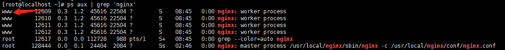
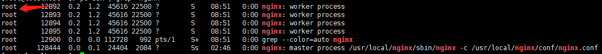
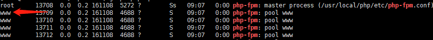

# 问题

LNMP安装之后，Nginx无法访问共享的目录

# 方法一 ROOT

一般来说无法的问题，基本上都是权限的问题，Nginx访问 403 Forbidden

查看Nginx的权限

```php
ps aux | grep 'nginx'
```



修改Nginx的权限为 root 启动

```php
vi /usr/local/nginx/conf/nginx.conf

# 修改user www www 为 user root root

nginx -s reload
```



这样Nginx就能访问挂载下的目录文件了，至少 静态文件 ok的

没错，仅仅是静态文件，**php文件是无法访问的**

查看php-fpm的权限

```php
ps aux | grep 'php-fpm'
```



修改 php-fpm权限为root 启动

```php
vi /usr/local/php/etc/php-fpm.conf

# 以下修改为 root
# user = root
# group = root
```

```php
service php-fpm restart

Gracefully shutting down php-fpm . done
Starting php-fpm [08-May-2019 09:13:48] ERROR: [pool www] please specify user and group other than root

```
没错，shut down 是成功了，但是启动不了，无法用root启动的。当然非要启动也有办法

```php
php-fpm -R

# more php-fpm --help
```

这样子就成功用root启动了

之后访问 php文件，你会发现 可以被解析了

当然这个方法不推荐，安全性太低了，虽然开发环境无上大雅，但是生产环境是不能允许的

**思考：难道就没有更好的解决方案了？**

# 方法二 (推荐)

答案当然是有的！！

既然无法越权访问，那么思路就是允许其他组访问

Nginx 和 PHP 默认都是www组，那么就让挂载的文件的权限为 www

```php
# 查询组ID
id www
# uid=1001(www) gid=1001(www) 组=1001(www)
```

```php
如果每次重启之后想让系统自动挂载 #vi /etc/fstab:
在最后添加一行：
.host:/VM_Shared /mnt/hgfs fuse.vmhgfs-fuse allow_other 0 0
```

```php
.host:/ /mnt/hgfs fuse.vmhgfs-fuse allow_other,uid=你的uid,gid=你的gid
```

此方法替换之前开机自动挂载的方法

参考文章：
[【同问题】Using a mounted NTFS share with nginx](https://serverfault.com/questions/425608/using-a-mounted-ntfs-share-with-nginx)
[【解决】vmware挂载了windows的共享目录给nginx使用的默认用户组的问题](https://www.144d.com/post-584.html)

# END

爬坑的过程，还算不错，挺好的


